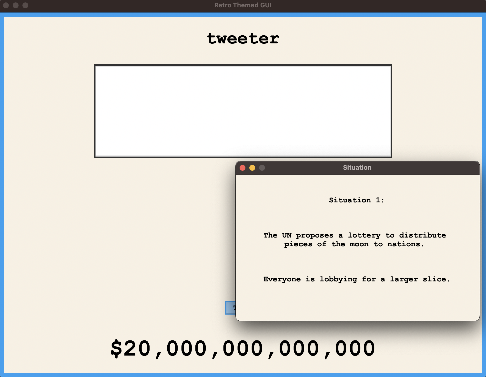
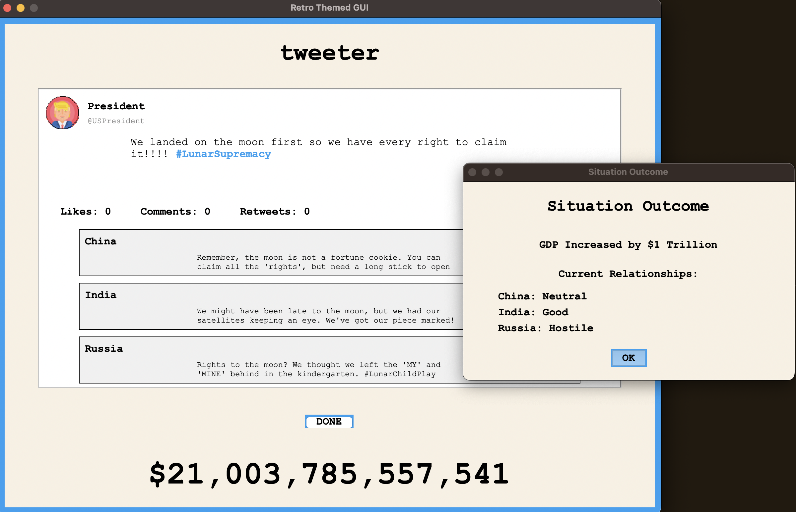
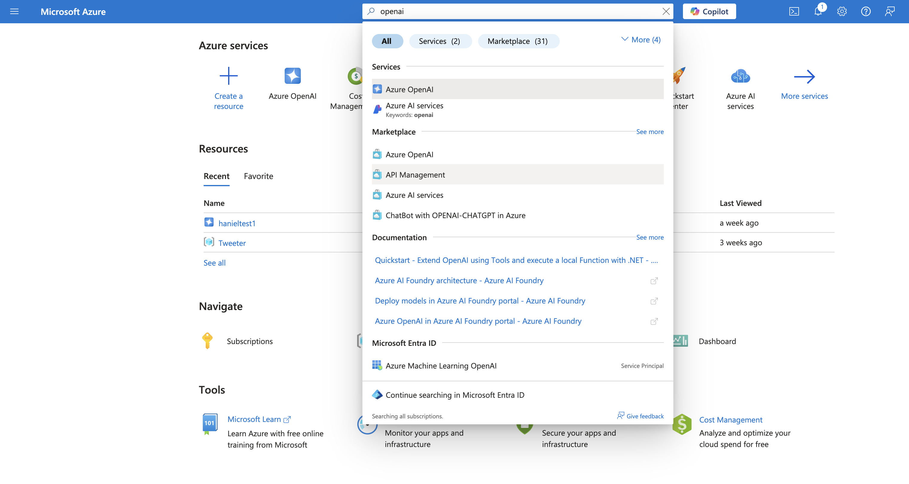
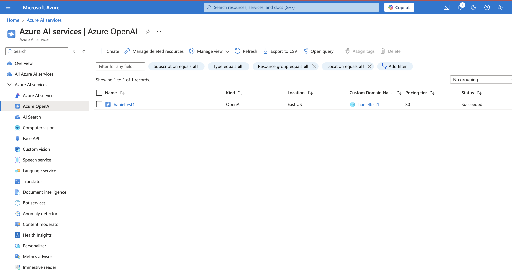
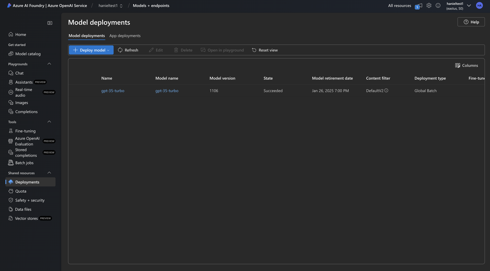
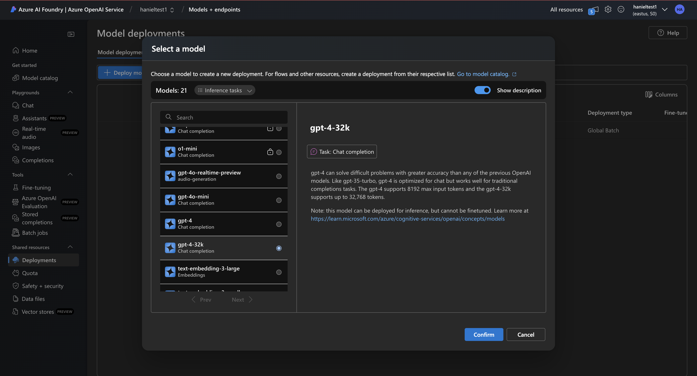

# Tweeter

## Overview

Welcome to **Tweeter**, an engaging strategy game where you step into the shoes of the newest President of the United States, **Tonald Drump**. Your primary mission is to **increase the GDP of the US** by navigating through various challenges and scenarios that arise during your presidency.

In the game , your decisions are made through a social media platform called **Tweeter**. Every "twit" you post will influence not only the domestic economy but also how the international community perceives you and your country. It's a delicate balance—choose your words wisely to foster economic growth while maintaining positive international relations!

### Features

- **Role-Playing as President Tonald Drump:** Experience the pressures and responsibilities of leading a nation.
- **Dynamic Decision-Making:** Respond to real-time situations through your Tweeter account.
- **Dynamic Reactions from Other Nations:** Watch as other countries react in real-time to your custom-made twits, influencing international alliances, trade agreements, and geopolitical stability.
- **Multiple Outcomes:** Achieve different outcomes based on your decisions and their impacts.

### How to Play

1. **Monitor Situations:** Keep an eye on various domestic and international events that require your attention.
2. **Craft Your Twits:** Respond to situations by composing twits. Each choice will influence both the economy and international relations. Strive for the right balance to achieve your objectives.
3. **Achieve Success:** Successfully navigate through challenges to grow the GDP and secure your legacy.

### Screenshots




-----

### Prerequisites

- **Python:** Python 3.8 or higher
- **Package Manager:** pip3
- **Git:** To clone the repository

### Setup

1. Clone the repository:
   ```bash
   git clone https://github.com/mahadevmohan/Tweeter
   ```

2. Install dependencies:
    ```bash
     pip install -r requirements.txt
     ```

3. Setup Azure OpenAI GPT Deployment API:
    - Create a Microsoft Azure account using your school email ID to get 100$ in free Azure credit (https://azure.microsoft.com/en-us/free/students). If you are not a student, you will likely need to pay for the OpenAI GPT deployments.
    - In the Azure portal (https://portal.azure.com/), search for the Azure OpenAI icon and open it to create an OpenAI deployment with the default settings.
    - Click on your OpenAI deployment and then click on the `Open Azure AI Foundry Portal` button on that screen.
    - With the Azure AI Foundry Portal, navigate to the deployments section on the left hand side of the screen and deploy a base model gpt of `gpt-4-32k` or `gpt-35-turbo-16k`
    - Once deployed, use the Target URI and Key of the GPT deployment to populate your `.env` file in the folder you cloned the Tweeter repo to. Here is the skeleton of the .env file:
        ```
        ENDPOINT_URL=https://your-azure-openai-endpoint/
        AZURE_OPENAI_API_KEY=your-azure-openai-api-key
        DEPLOYMENT_NAME=your-deployment-name
        ```



    

4. Run the `main.py` file to start playing!


        


